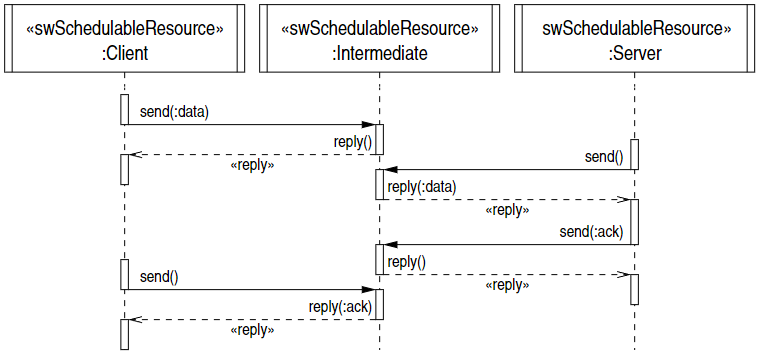
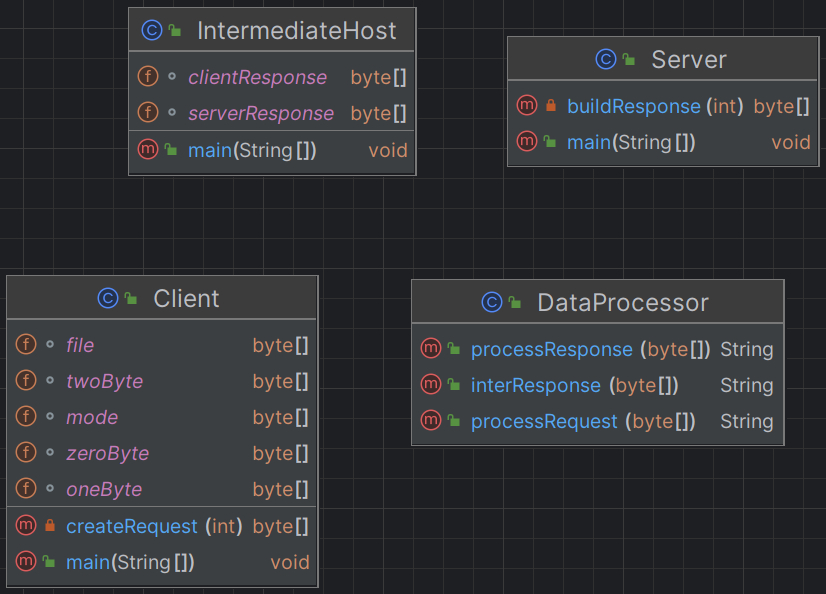

# SYSC 3303 Assignment 4

Joseph Vretenar 101234613

## Remote Procedure Calls
This assignment is an extension of assignment 2, where I implemented UDP connections between a client and a server
through an intermediate host. This system would send a request from client to intermediate host, which would send
it to the server, the server would verify this request and send a response to intermediate host, which would send
it to the client. 

This assignment changes the system to use Remote Procedure Calls (RPC) instead of the previous system. This means
the client will send data to the intermediate host which will reply with a received response. The server will send a request
for the data that the client sent to the intermediate host, and the intermediate host will reply with the data.
The server will then send an acknowledgement to the intermediate host, which will reply with a received response.
The client will then send an acknowledgement request to the intermediate host, which will reply the server's acknowledgement.
This system can be seen in the diagram below:


## Files
### [Client.java](src/main/java/Client.java)
This is the client file, when it runs, it will send data to the intermediate host, and then receive the data back from the intermediate host.
The client will then send a request for acknowledgement to the intermediate host, which will send back acknowledgement when it receives it from 
the server.

### [IntermediateHost.java](src/main/java/IntermediateHost.java)
This is the intermediate host file, it will be waiting for the requests from client and server. When it receives requests
it will send back the appropriate responses based on the request it received.

### [Server.java](src/main/java/Server.java)
This is the server file, when it runs, it will send a request to the intermediate host for the data that the client sent which will send the data back. 
When the server receives the data, it will send an acknowledgement to the intermediate host, which will send back a received response.

## Setup Instructions
1. Make sure java is installed on your system
2. Compile the Java files using an IDE or through command lines
3. Run the files in the following order:
    1. Run the IntermediateHost file
    2. Run the Server file
    3. Run the Client file

## Expected Output
The client file should produce this output:
```
Sent request  0 1 0 test.txt 0 netascii
Response from Intermediate Host: forwarding to server
Sent acknowledgment request to Intermediate Host
Received acknowledgement from Intermediate Host 0 3 0 1 
```

The intermediate host file should produce this output:
```
Received request from client 0 1 0 test.txt 0 netascii
Confirmed data received to client
Received data request from server
Sent data to server
Received acknowledged data from server: 0 3 0 1 
Confirmed acknowledgment received to server
Received acknowledgment request from client
Sent acknowledgment to client
```

The server file should produce this output:
```
Sent data request to Intermediate Host
Received data from intermediate 0 1 0 test.txt 0 netascii
Sent acknowledgment to Intermediate Host: 0 3 0 1 
Response from Intermediate Host: forwarding to client
```

## Questions and Answers
1. **Why did I suggest that you use more than one thread for the implementation of the intermediate task?**<br>
    Using more than one thread for the implementation of the intermediate task can improve the overall efficiency of the system.
    This mainly happens with asynchronous UDP communication, as having separate threads for packets going from client to the server and 
    packets going in the opposite direction allows the intermediate task to handle concurrent communication streams independently.
    This separation can prevent blocking and latency issues that may arise if all communication is handled sequentially in a single thread.<br><br>

2. **Is it necessary to use synchronized in the intermediate task? Explain.**<br>
    The use of synchronized in the intermediate task depends on the use of multiple threads. If the intermediate task is using multiple threads
    there is the potential for a critical section to be accessed by multiple threads at the same time. This would need to be avoided by the use
    of synchronized threads. However, if the intermediate task is only using a single thread, then the use of synchronized is not necessary as
    there is no potential for a critical section to be accessed by multiple threads at the same time.

## UML Class Diagram
The UML Class Diagram for this system can be seen below:
